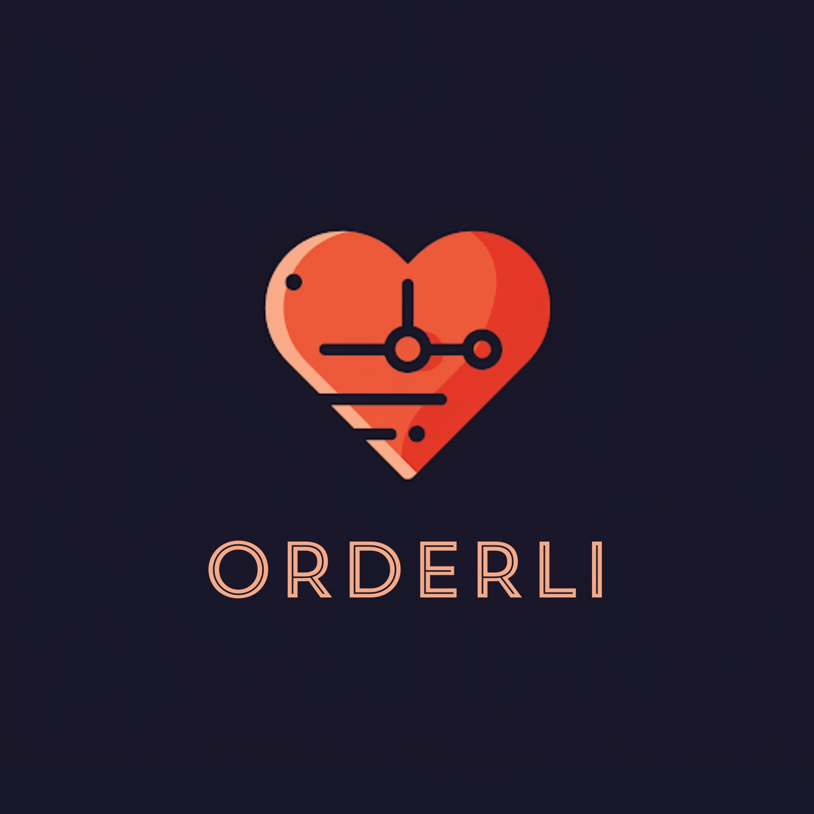
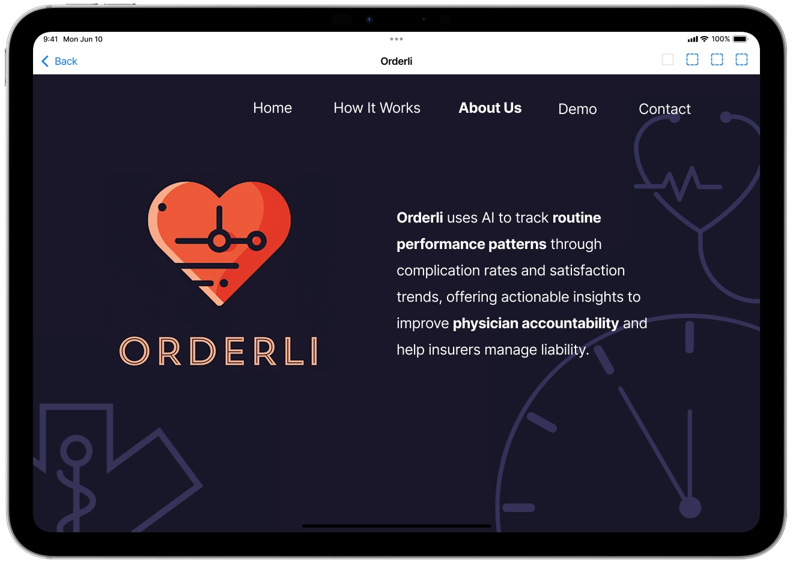
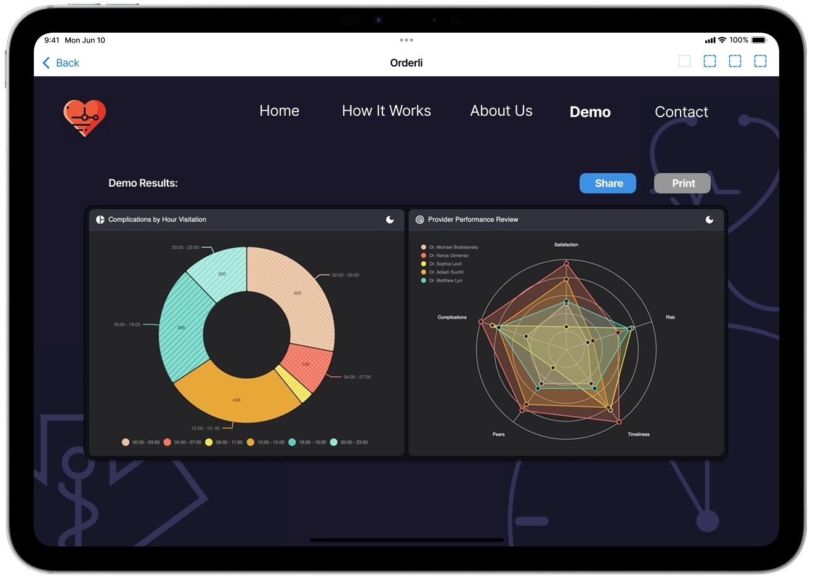
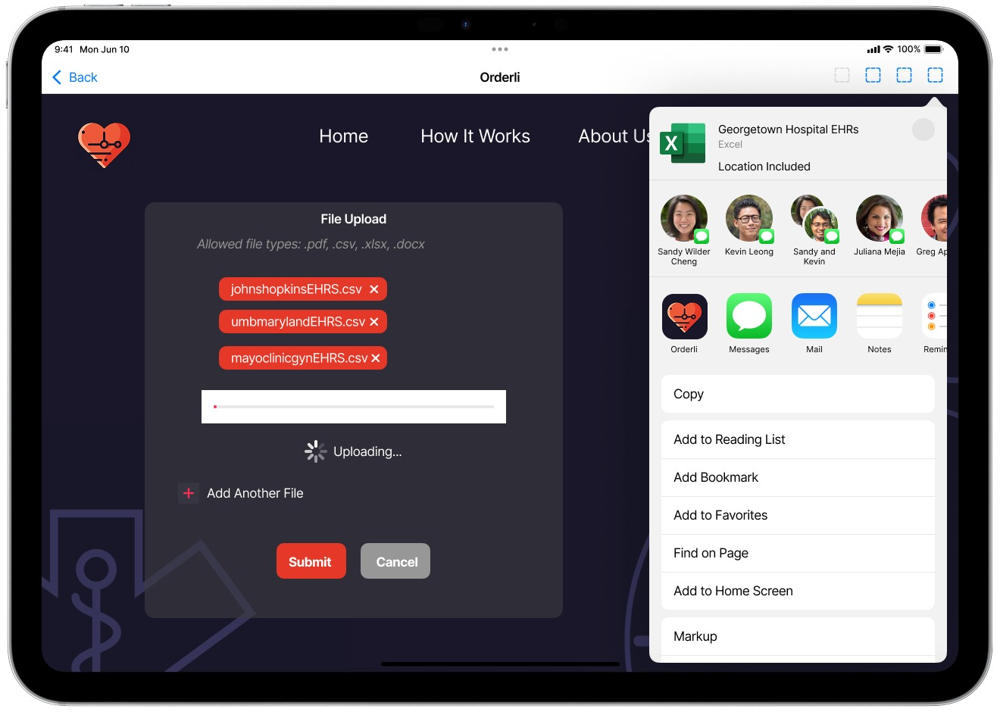

# Orderli: Scheduler for Patient Safety, and Risk Management


## Summary

Orderli is a AI/ML powered application designed to assist hospital risk managers predict providers’ risk of complication and suggest scheduling adjustments. This ensures that the right providers are assigned to the right schedules for their procedures, maximizing patient safety and clinical efficacy.

- **Optimized Scheduling:**  
By aligning provider risk with procedure scheduling, the app ensures that patients receive care from providers best suited for the procedure. This optimization leads to higher treatment efficacy and a reduction in complications.

- **Proactive Risk Identification:**  
The machine learning model continuously assesses risk, identifying providers' schedules that may present a higher likelihood of complications. This enhances patient safety by allowing for early intervention before risks translate into actual safety issues.

- **Improved Resource Management:**  
The app aids in allocating provider resources more effectively, ensuring that the most suitable staff are scheduled for procedures. This targeted approach helps mitigate risks and enhances operational efficiency.

## Photos

### Home Page


### App View


### Share Screen


## Pitch/Story

### Inspiration
Imagine a 17-year-old whose heart has stopped working. This young person, with their entire life ahead of them, has just flat-lined. However, the question remains - was their death preventable? It is estimated that over 200,000 deaths occur as a result of Medical Errors, with estimates of medical complications impacting 400,000 people annually.

Just like athletes function best at their peak time (well-rested, clear-minded, etc.), physicians are the same. Each doctor functions better at different time. This theory has been validated in the scientific literature, with many peer-reviewed studies describing physician performance worsening as time goes on throughout the day, and fluctuating during the week. 

Yet, the industry is not changing; doctors are operating at all sorts of times without much feedback into the minor errors they could be making on a day to day. Therefore, we realized that using the power of AI, we can take advantage of existing patient complication data to see where physicians may be under-performing, bringing this data to life to make tangible changes.


## What it does
Our Machine Learning model predicts each physician's risk of complication using past performance data. Our algorithm assess physicians' Electronic Health Records and claims to find instances where the [CPT Procedure Code](https://www.aapc.com/codes/cpt-codes-range/) does not match our proprietary list [ICD10 Diagnosis Code's](https://www.cdc.gov/nchs/icd/icd-10-cm/index.html) list of acceptable procedures.

By having our machine learning algorithm flag such instances, we can proactively alert risk managers as to when physicians are most/least likely to undertake risky/unorthodox procedures. While incidental risk can never be eliminated, we help hospital risk managers accurately budget risk and reduce the financial reserve held for insurance purposes.

## How we built it
This app was built using python's [Streamlit](https://streamlit.io) library to provide the "front-end". The data we used to test the [Scikit-Learn](https://scikit-learn.org/stable/) RandomForestRegressor model was synthetically generated by the group (see `gen_data.py`) and the [Faker](https://faker.readthedocs.io/en/master/) library to provide "life-like" values.

Finally, for data manipulation, we used the [DuckDB Analytical Database](https://duckdb.org) was used as the embedded database for both storing the Machine Learning data and any intermediate manipulation with SQL. Finally, the [Polars](https://pola.rs) library was used for encoding the data into different file formats.

## Challenges we ran into
Data provided by the Center for Medicare Services was both opaque and inaccesible for our use-case despite having a series of datasets titled: "[Synthetic Medicare Enrollment, Fee-for-Service Claims, and Prescription Drug Event](https://data.cms.gov/collection/synthetic-medicare-enrollment-fee-for-service-claims-and-prescription-drug-event)".

Creating a synthetic dataset which was life-like, coherent, and contained meaningful patterns for us to train a machine learning model on was a significant challenge. While we were able to generate life-like, and coherent data, the extra step of imprinting the data with meaningful patterns was a greater challenge than we could tackle during this hackathon.

## Accomplishments that we're proud of
We are proud of our product for several reasons. The user interface makes our AI app really accessible. The goal of this project was to make something that could be utilized by different departments and have real benefits, which can only be possible if the operability of the app is straightforward. We are also proud to have addressed a glaring issue in the healthcare system from a feasibility perspective. 

While our topic was patient safety, we did this by focusing on the providers themselves, a novel approach to a common issue that can actually be implemeneted into a hospital setting. Furthermore, many of the issues we are addressing are not just mitigating the symptoms, they are addressing the root of the problem. While the field should focus on helping patients recover from medical errors, we address the root cause of these medical errors, many of which may have not been brought to the forefront of discussion. 

## What we learned
We learned to tailor AI towards a unique problem. At first, we were very ambitious in what we wanted our algorithm to accomplish, but with time we realized we needed to focus our application. We also learned to identify a clear target with our AI. Since AI is so broad, it was important to select a specific use for it. 

Finally, and potentially the most important lesson was that we learned was how many areas for improvement we can target using AI in healthcare. Many of the solutions we brainstormed would not be possible had AI not been a tool for us. However, since the whole project was AI focused, we really got thinkning of all the new possibilites, which helped expand our horizons and was great exercise. 

## What's next for Orderli Technologies
We hope to continue to improve our user interface to make operability superb. With many health AI start-ups emerging, maintaining the best quality will help us continue to differentiate against out competitors. Also, we hope to continue to leverage real data to see our algorithm continuously improve. 

Finally, we wish to apply our algorithm to other industries. Are there times when pilots make mistakes? Is there a time a medical device manufacturer is making a mistake more frequently? Applying our framework to other industries to improve quality for all is the ultimate goal.

## Setup Instructions

1. Install the [Poetry Package Manager](https://python-poetry.org) if you haven't already. The following command will install any required dependencies from the `pyproject.toml` file:

```poetry install```

1. To run the app, execute the following command:

```poetry run streamlit run app.py```

1. Access the streamlit app in the browser by clicking either the `Local URL` or `Network URL` left in the terminal.

```
  You can now view your Streamlit app in your browser.
  Local URL: http://localhost:8501
  Network URL: http://10.126.250.240:8501
```